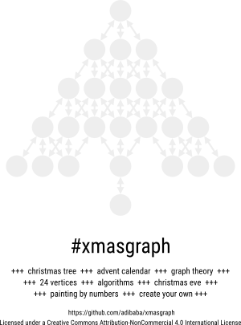

# xmasgraph

A graph template, which an be used for creating advent calendars or teaching/learning approaches in November/December.

Teaching ideas:

- Perform a BFS or another algorithm.
- How many (directed) graphs can be generated using the template (graph theory)?

Advent calendar ideas:

- Print it, laminate it, put acrylic paints on the nodes. Let others rub it away.
- Get some LEDs, a single-board computer and let it shine!

## PDF Download

&nbsp; | US letter | DIN A4
--- | ------------ | -------------
**Template 1** | [Template 1 - US letter](../../raw/master/templates/3.1.us-letter.pdf) | [Template 1 - DIN A4](../../raw/master/templates/3.1.din-a4.pdf)
**Template 2** | [Template 2 - US letter](../../raw/master/templates/3.2.us-letter.pdf) | [Template 2 - DIN A4](../../raw/master/templates/3.2.din-a4.pdf)
**Example** | [Example US letter](../../raw/master/examples/3.breadth-first-santa.us-letter.pdf) | [Example - DIN A4](../../raw/master/examples/3.breadth-first-santa.din-a4.pdf)

## Preview

### Template 1

### Template 2

### Example

