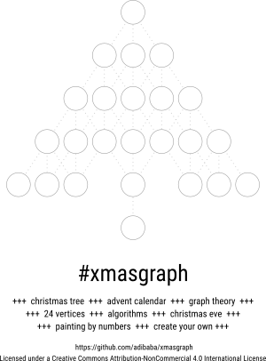

# xmasgraph

xmasgraph is a graph template, which an be used for creating advent calendars or teaching/learning approaches in November/December.

The graph consists of 24 vertices (nodes/circles/bubbles/stars) at fixed positions.
The vertices can be connected layer by layer.

The templates listed below are designed for DIY handicraft projects.

Teaching ideas:

- Perform a BFS or another algorithm.
- How many (directed) graphs can be generated using the template (graph theory)?

Advent calendar ideas:

- Print it, laminate it, put acrylic paints on the nodes. Let others rub it away.
- Get some LEDs, a single-board computer and let it shine!

The works are licensed under a Creative Commons Attribution-NonCommercial 4.0 International License ([CC BY-NC 4.0](http://creativecommons.org/licenses/by-nc/4.0/)).

## Download

### #xmasgraph templates

&nbsp; | US letter / PDF | DIN A4 / PDF | Inkscape SVG | yEd graphml
------ | --------------- | ------------ | ------------ | -----------
**Template 1** | [US PDF](../../raw/master/templates/3.1.us-letter.pdf) | [A4 PDF](../../raw/master/templates/3.1.din-a4.pdf) | [SVG](../../raw/master/templates/3.1.inkscape.svg) | [graphml](../../raw/master/development/3.1.yed.graphml)
**Template 2** | [US PDF](../../raw/master/templates/3.2.us-letter.pdf) | [A4 PDF](../../raw/master/templates/3.2.din-a4.pdf) | [SVG](../../raw/master/templates/3.2.inkscape.svg) | [graphml](../../raw/master/development/3.2.yed.graphml)

### #BreadthFirstSanta (BFS)

&nbsp; | US letter / PDF | DIN A4 / PDF
------ | --------------- | -------------
**Version 1** | [US PDF](../../raw/master/examples/3.breadth-first-santa.us-letter.pdf) | [A4 PDF](../../raw/master/examples/3.breadth-first-santa.din-a4.pdf)
**Version 2** | [US PDF](../../raw/master/examples/3.breadth-first-santa.2.us-letter.pdf) | [A4 PDF](../../raw/master/examples/3.breadth-first-santa.2.din-a4.pdf)

## Preview

### Template 1

### Template 2

### Example: Breadth First Santa (BFS)

